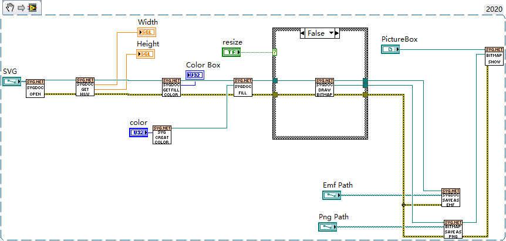

# SVG-NET FOR LABVIEW
https://github.com/lv-tools/LV-SVG-NET

Labview调用SVG NET读取SVG格式图像并转换成 PNG 或 EMF，支持调整PNG分辨率大小和设置SVG颜色

因为新版的Svg-net将库拆分为多个dll，为减少依赖文件使用svg-net版本为3.0

 Labview版本

- labview2020

 參考

- [GitHub - svg-net/SVG](https://github.com/svg-net/SVG)

- [.net - How to convert an SVG file to an EMF file in C# - Stack Overflow](https://stackoverflow.com/questions/26151961/how-to-convert-an-svg-file-to-an-emf-file-in-c-sharp)

